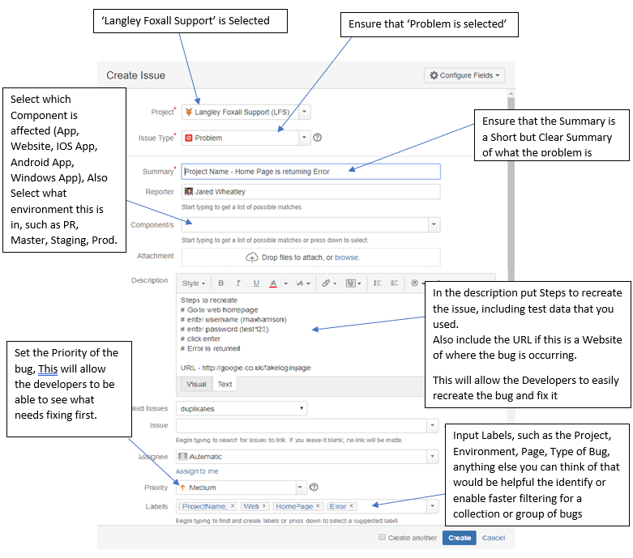

# 📚 QA Testing Stages and Formatting

This Section is to instruct on when to test and how you should be formatting the Bugs.

For staging we are following a multi stage testing to enable us to ensure that the customer is getting a bug free and fully functioning system. This will be a merge between Agile and Waterfall.
		
### QA Stages
										
#### Stage 1 - Dev Testing:
This stage is for the Developers to test and ensure that there are not obvious bugs and that the code is working as expected before they create a PR (Pull Request), This will ensure that QA is not wasting time on obvious bugs that could have easily been spotted during development and be fix them before the PR.
												
#### Stage 2 – PR (Pull Request) Testing:
At this stage the PR has been created and this requires 2 steps of acceptance.
One check will be from a member of the Developer Team to check over the code is to review the code itself. 
The other Check will be from QA, that will test the code changes itself, ensure that it is working and there are not bugs in the relevant area. This is more of a Spotlight Check, testing around each change that has been made and near areas that could be affected by this change, this will have a high density of testing to ensure that we catch as many bugs as possible, no matter how small or unlikely the bug appears all bugs must be reported.
Once Both parties have accepted the code we will then go onto Stage 3
												
#### Stage 3 – M2S (Master to Staging) Testing:
This area of testing is large end to end testing, This means that in terms of testing, we start of as a brand new user, with a cleared database (as much as can be cleared), This testing will go through the flows the customer will follow, This will require multiple user type testing such as (Client, Admin, User, Operative, Ect..), This will span through to an App if the customer has an App, Even if no changes have been made to the App. This will ensure that the customer flow will be clear and will be able to with confidence be able to say that this project works.

### Testing Status

For Stage 2 and Stage 3 Lists of tests completed for each test is required, with each test you will need a Status. The Status are as follows;
- Passed – The testing passed and has been confirmed to work as expected.
	- Data Required 
		- Notes.
		- Test data used.
		- Screenshots if relevant.
		- Your Name.
- Failed – The testing failed and is not working as expected.
	- Data Required
		- Notes.
		- Test Data used.
		- Bug Number Raised.
		- Your Name.
- Blocked – Testing has not been started as can’t be tested due to a Bug Already Raised by a failed test.
	- Data Required
		- Notes
		- Bug Number Raised
		- Your Name.
- OOS (Out of Scope) – Test has been moved to OOS as it is not in the scope of testing for this Stage of Testing.
	- Data Required
		- Manager who confirmed OOS
		- Your Name.

### Raising A Bug

When you find a bug, you will need to raise a bug on the Jira Service Desk.
This bug will require multiple areas to be filled in, these are as Below:

