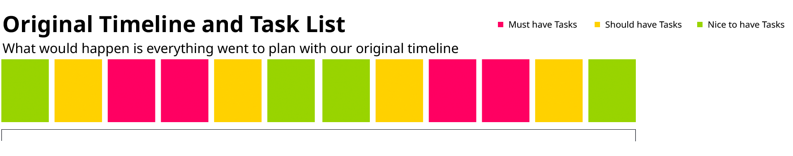
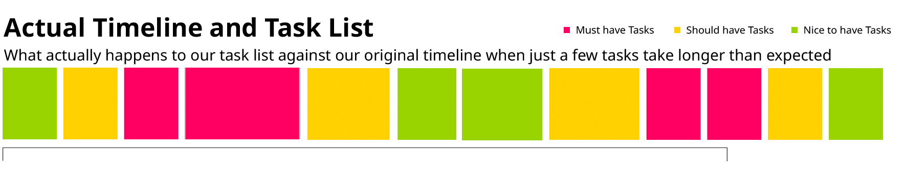

# Langley Foxall Software Philosophy

Langley Foxall have grown quickly over the past few years through building a culture of trust and quality between ourselves
and our customers. 

Due to this being the main source of our scaling, this means that we think it's important to keep that culture going as
we scale, which means ensuring the developers are on the same page when it comes to building the product that has gotten
us this far.

### Technical Excellence
First and foremost, developers should be pushing to be the best. Producing code that they would be happy to use as an
example, that they wouldn't want to re-write, and wouldn't mind working on in the future. Maintenance and the future
longevity of projects, their architecture and codebase are the most important values. 

##### Make it right
Focusing on a solution before implementation should be a universal trait of developers. There are many ways to skin a
cat but most of them aren't efficient, understandable or clean. 

Ensuring that the solution is done properly in the first place means that someone won't groan when they find it.

##### Make it better
Making it right is fantastic for future projects, but what about older, inherited projects that you already hate working
on? 

EVERYONE has to work on a "bad" project every now and again. It may be inherited, may be some code that a colleague
wrote, hell - it might even be code that you wrote before you were the wise developer you are today..

Regardless, projects are only "good" to work on if they're done to a workable standard. This is sometimes hard to achieve
in a longstanding project that doesn't have the time or budget to be re-written or ripped apart.

One way you can ensure the slow improvement of a codebase is to **leave a file better than you found it**. Sometimes it's
easy to shift the blame of technical debt onto others than to get stuck in and sort issues out, but adding to a poor
codebase isn't going to do anyone any good.

### Commercial Viability
Now to contrast on everything that we just spoke about. Business is business and sometimes there are time constraints to
how *nice* we can make the UI or what *"helpful features"* we can put in.

##### MoSCoW Method
Shamelessly pulled from [wikipedia](https://en.wikipedia.org/wiki/MoSCoW_method);

> The MoSCoW method is a prioritization technique used in management, business analysis, project management, and software 
development to reach a common understanding with stakeholders on the importance they place on the delivery of each 
requirement; it is also known as MoSCoW prioritization or MoSCoW analysis.

This becomes vital when planning the development schedule of a project. Knowing what the customer needs over wants quickly
becomes important when it comes to stretching their budget as far as it will go. They might *want* a rear view camera
in their car, but they should probably have the engine first.

##### Make it quickly
There is a certain art to building software to a budget, and building solid software at that. Often developers can find
that they want to move onto the less fundamental and less boring part of a project to focus on some interesting logic, 
or that they want to see a view scaffolded completely with the must-have tasks **and** the nice-to-haves.

No matter what you do - **PLEASE PLEASE** refrain from doing this. There are times when you will be building some repetitive
CRUD functionality or building some static views that don't have much going on, but most of the time these are the most
important to the user journey/experience. This ensures that the user will have the most complete *flow* at all times
throughout the project

##### MVP
We see this work more commonly in a MVP (Minimum Viable Product) methodology, where you write the least amount of code
to satisfy a story point. This enables us to get the most functionality in the smallest amount of time, push that
functionality out to the end users for review and move on, knowing whether it aligns with the users thoughts or not.

This also means that we get any nasty suprises or hiccups as soon as possible throughout the timeline, which helps
project managers understand where time might be saved, or where we may need some more resource to bring in the deadline.

This is usually explained best in a graphic.

We can see in the above image that it seems all of the features that the client wants will fit into the timeline. The
stars have aligned and this will be the perfect project and everyone will be happy. Great, right?

Unfortunately we all now that's not how things plan out, and with just a few minor issues that extend a few of the tasks,
the original deadline comes and goes and we don't even have all of the must have features in yet, meaning we cannot
deploy this - we are forced to make up the different and the project is late. 

With just a little bit of planning we can actually re-arrange the order in which we do things. Tasks might take slightly
longer here or there but it's okay because the project is already at a state where it is more than deliverable at the
deadline, meets the clients budgets and means they can get using the software - without compromising the company.
