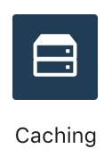

# Caching

The Caching tab allows you to purge assets, set the caching level as well as enable or disable development mode.

Go to the Caching tab to get started

## Purge Cache

The Purge Cache options allow you purge individual static assets or purge the entire cache. When you update a file
on the origin server (or S3 bucket) you may need to clear the cache if you would like the changes to appear immediately.

You can purge individual files by select the `Custom Purge` options and entering the URL of the file(s) you would like to purge.
You can alternatively purge the entire cache by choosing `Purge Everything`, this is not recommended as it will slow down your 
entire site until the assets have been cached again by CloudFlare.

CloudFlare only caches certain file extensions, you can read more 
[here](https://support.cloudflare.com/hc/en-us/articles/200172516-Which-file-extensions-does-Cloudflare-cache-for-static-content).

## Browser Cache Expiration

The Browser Cache Expiration options allow you to instruct the clients browser to only cache the files for a certain length of time before
requesting the latest changes. This has a maximum of expiration time of `1 year`.

## Always Online

The Always Online functionality allows you to show a snapshot of your website so clients can still see some content of your website.
An alert will be displayed at the top of the page informing users that your site is currently experiencing problems.

Always Online will only be triggered on certain status codes:

* 500
* 503
* 4XX

## Development Mode

The development mode functionality allows you to bypass the caching that CloudFlare provides to display immediate changes. Development mode
only remains enabled for three hours, after which it will automatically disable. Enabling development mode will slow down your website 
temporarily.
