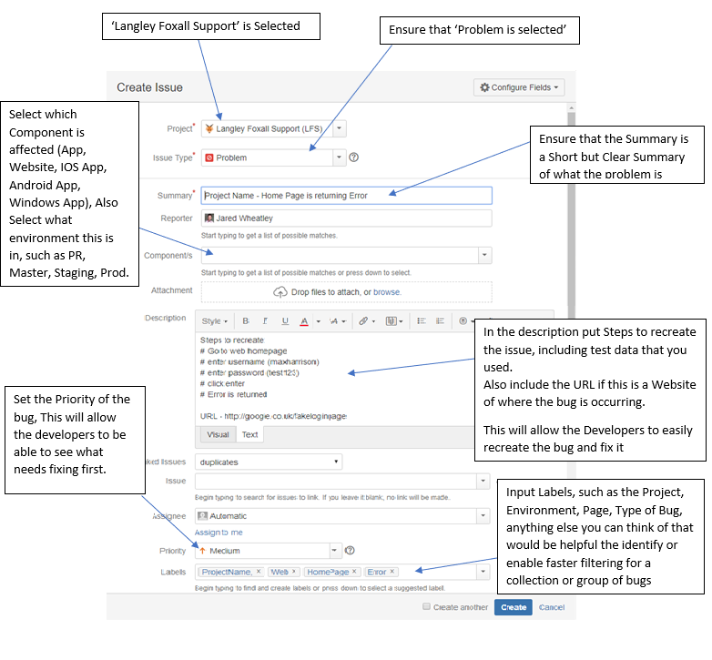

# ♻️ QA Testing Stages, Formatting and GuideLines

This Section is to instruct on when to test, how you should be formatting the bugs raised and guideLines for QA

## Developing with QA in mind
### Commands
When you are developing a project, the project might require commands to run and work correctly, these can range from simple set up commands to automatic updating commands, a list of these commands and a brief description of what these commands do will help QA move more smoothly and avoid raising unnecessary questions.

Some projects require certain status or manipulation of the database to update systems and cause it to do the next stage/part of the system to test. We would like these to be formed into commands if it is a complex task or a detailed outline of what is required to be completed and a description of when and why you would need to do this, QA should have minimum contact with database directly, this leads to user error. This will allow the tester to carry out complex tasks without directly modify the database or sensitive areas of the application.

### ENV
Ensure that the 'env.example' is update and remove redundant fields/areas that are not required anymore.
		
## QA Stages
For staging we are following a multi stage testing to enable us to ensure that the customer is getting a bug free and fully functioning system. This will be a merge between 'Agile' and 'Waterfall'.
										
### Stage 1 - Development Testing
This stage is for the developers to test and ensure that there are not obvious bugs and that the code is working as expected before they create a PR (Pull Request). This will ensure that QA is not wasting time on obvious bugs that could have easily been spotted during development and be fix them before the pull request is made.
												
### Stage 2 – PR (Pull Request) Testing
At this stage the PR has been created and must adhere to the following criteria before being accepted.
One check will be from a member of the development team to check over the code is to review the code itself. 
The other check will be from QA, that will test the code changes itself, ensure that it is working and there are not bugs in the relevant area. This is more of a 'Spotlight Check', focused testing around each change that has been made and near areas that could be affected by this change. No matter how small an issue might seem it must be reported and signed off before continuing.
Once both parties have accepted the code we will then go onto Stage 3.
												
### Stage 3 – M2S (Master to Staging) Testing
This area of testing is large end to end testing. We start by creating a new user, with a cleared database (as much as can be cleared). Testing will be used as if the customer was using the system, this would include all different user types such as: client, admin, worker. If a customer has a web application, mobile application, and any other applications then this process will be repeated for each one until QA is confident to say that the applications are working as expected.

### Stage 4 - Production Testing
This area of testing is to test all key functionally of the application on prod to ensure that the application can function and does function as expected.
If any urgent issues are found they should be raised and created as hotfixes, if they are not urgent they should go into the development branch and start the testing process again (from stage 2).

#### Staging - Prod Merge Timing
Timing is a very important point in the merge between Staging and Prod.
- We do not want to do it at peak working hours as this increases the chance of disrupting customer workflow.
- We do not want to do it towards the end of the day as if something were to go wrong it would delay resolution times until the next morning.
- We do not want to do it on Fridays as if something were to go wrong it would delay resolution times until the next working day.
It is worth noting that each customer has different situations and stances on when they want their applications updating. So it is always worth confirming with the customer before hand.

## Test Cycle
Test cycles are a collection of tests that need to be ran. Cycles should always be given a time frame and a time estimate to ensure that we are completing them in a timely manner and to enable management to organize work efficiently.

### Tests
For stage 2, stage 3 and stage 4, a list of tests is required, this is to keep track of what needs to be tested and to ensure that all functionality is tested and to ensure we don't do any unnecessary testing.
The structure of the tests are as follows:
- Test name
- Priority
    - Critical
    - High
    - Medium
    - Low
- Expected outcome
- Estimated time to complete testing
- Area of testing (such as the what pages/screens)
- Test data (If required)

### Testing Status
Each test requires a statuses once completed. The status are as follows:
- Passed – the testing passed and has been confirmed to work as expected.
	- Data required 
		- Notes.
		- Test data used.
		- Screenshots if relevant.
		- Your name.
- Failed – The testing failed and is not working as expected.
	- Data required
		- Notes.
		- Test data used.
		- Bug number raised.
		- Your name.
- Blocked – Testing has not been started as can’t be tested due to a bug already raised by a failed test.
	- Data required
		- Notes.
		- Bug number raised.
		- Your name.
- OOS (Out of Scope) – Test has been moved to OOS as it is not in the scope of testing for this stage of testing.
	- Data required
		- Manager who confirmed OOS.
		- Your name.

### Raising A Bug
When you find a bug, you will need to raise a bug on the 'Jira Service Desk'.
This bug will require multiple areas to be filled in, these are as Below:

### Test Data
When testing on 'Staging' and 'Prod' we will require valid data and credentials. These should be stored in a 'Google Docs' that the project lead/manager should have access to, these should be kept up to date. This should contain data that you need or is helpful to have when you are testing the given project. 
